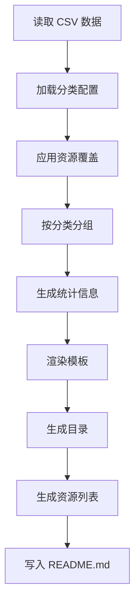

# 系统工作原理 | How It Works

本文档详细介绍了 Awesome Claude Code 项目的技术架构、自动化系统和核心工作流程。

This document provides technical details about the Awesome Claude Code project architecture, automated systems, and core workflows.

---

## 📋 目录 | Table of Contents

- [仓库架构](#仓库架构--repository-architecture)
- [核心文件](#核心文件--core-files)
- [脚本系统](#脚本系统--scripts-system)
- [数据模型](#数据模型--data-model)
- [README 生成流程](#readme-生成流程--readme-generation)
- [自动化工作流](#自动化工作流--automation-workflows)
- [本地开发](#本地开发--local-development)
- [维护任务](#维护任务--maintenance-tasks)

---

## 仓库架构 | Repository Architecture

### 设计理念 | Design Philosophy

Awesome Claude Code 采用 **单一数据源（SSOT）** 架构：

Awesome Claude Code uses a **Single Source of Truth (SSOT)** architecture:

- **数据层**：`THE_RESOURCES_TABLE.csv` - 所有资源的唯一数据源
- **模板层**：`templates/` - README 生成模板和分类定义
- **脚本层**：`scripts/` - 自动化处理和验证脚本
- **展示层**：`README.md` - 自动生成的最终展示文档

```
数据变更 → CSV 更新 → 脚本处理 → README 生成 → 用户查看
Data Change → CSV Update → Script Processing → README Generation → User View
```

---

## 核心文件 | Core Files

### 1. THE_RESOURCES_TABLE.csv

**单一数据源（SSOT）**，包含所有资源信息。

The **Single Source of Truth (SSOT)** containing all resource information.

**字段结构 | Field Structure**:

| 字段 Field | 说明 Description | 必填 Required | 自动填充 Auto-filled |
|-----------|-----------------|--------------|---------------------|
| ID | 唯一标识符 | ✅ | ✅ |
| DisplayName | 英文显示名 | ✅ | ❌ |
| DisplayName_ZH | 中文显示名 | ✅ | ❌ |
| Category | 主分类 | ✅ | ❌ |
| SubCategory | 子分类 | ❌ | ❌ |
| PrimaryLink | 主链接 | ✅ | ❌ |
| SecondaryLink | 次要链接 | ❌ | ❌ |
| Author | 作者名称 | ✅ | ⚠️ 部分 |
| AuthorProfile | 作者主页 | ✅ | ⚠️ 部分 |
| IsActive | 活跃状态 | ✅ | ✅ |
| DateAdded | 添加日期 | ✅ | ✅ |
| LastModified | 最后修改 | ❌ | ✅ (GitHub API) |
| LastChecked | 最后检查 | ✅ | ✅ |
| License | 许可证 | 推荐 | ✅ (GitHub API) |
| Description | 英文描述 | ✅ | ❌ |
| Description_ZH | 中文描述 | ✅ | ❌ |
| Tags_ZH | 中文标签 | ❌ | ❌ |
| IsPinned | 是否置顶 | ❌ | ❌ |
| Section | 所属区块 | ❌ | ❌ |

### 2. README.md

**自动生成的展示文档**，不应手动编辑。

**Auto-generated display document**, should not be edited manually.

生成来源：
- CSV 数据
- 模板文件
- 分类配置
- 资源覆盖配置

### 3. templates/ 目录

#### templates/README.template.md
主模板文件，定义 README 的整体结构。

Main template file defining the overall README structure.

#### templates/categories.yaml
**分类定义的单一数据源**，包含：

**SSOT for category definitions**, including:

```yaml
categories:
  - id: official-resources          # 分类 ID
    name: "Official Resources"       # 英文名称
    name_zh: "官方资源"              # 中文名称
    prefix: "off"                    # ID 前缀
    icon: "🏛️"                       # 图标
    order: 1                         # 排序
    description: "..."               # 描述
    subcategories:                   # 子分类
      - id: general
        name: "General"
        name_zh: "通用"
```

#### templates/resource-overrides.yaml
资源的手动覆盖配置，用于特殊情况：

Manual override configuration for special cases:

```yaml
resources:
  resource-id:
    skip_validation: true          # 跳过链接验证
    display_name: "Custom Name"    # 自定义显示名
    description: "..."             # 自定义描述
```

#### templates/sections/
模板片段目录，包含可重用的 Markdown 片段。

Template sections directory containing reusable Markdown snippets.

---

## 脚本系统 | Scripts System

位于 `scripts/` 目录，所有脚本均可独立运行。

Located in `scripts/` directory, all scripts are self-contained and executable.

### 核心脚本 | Core Scripts

#### 1. generate_readme.py
**最重要的脚本**，从 CSV 数据生成 README.md。

**The most important script**, generates README.md from CSV data.

**功能 Features**:
- 读取 CSV 数据
- 应用分类和覆盖配置
- 按分类和子分类分组
- 使用模板生成 Markdown
- 生成统计信息
- 创建目录和锚点

**运行 Run**:
```bash
make generate
# 或 or
python scripts/generate_readme.py
```

#### 2. validate_links.py
验证所有资源链接的可访问性。

Validates accessibility of all resource links.

**功能 Features**:
- HTTP 状态检查（200-299 = 有效）
- 重定向处理
- 速率限制控制
- 结果缓存
- 批量验证

**运行 Run**:
```bash
make validate
# 或验证单个链接 or validate single URL
make validate-single URL=https://example.com
```

#### 3. validate_csv.py
验证 CSV 文件的数据完整性。

Validates CSV file data integrity.

**检查项 Checks**:
- ✅ 所有必填字段已填写
- ✅ ID 唯一性
- ✅ URL 格式正确
- ✅ 分类名称匹配 categories.yaml
- ✅ 日期格式正确
- ✅ 布尔值格式正确

**运行 Run**:
```bash
make test
# 或 or
python scripts/validate_csv.py
```

#### 4. auto_fill_github_metadata.py
自动从 GitHub API 获取并填充仓库元数据。

Automatically fetches and fills repository metadata from GitHub API.

**功能 Features**:
- 检测 GitHub 仓库链接
- 获取许可证信息
- 获取最后提交日期
- 获取仓库描述
- 获取作者信息

**运行 Run**:
```bash
python scripts/auto_fill_github_metadata.py
```

#### 5. update_github_metadata.py
定期更新 GitHub 仓库的元数据。

Periodically updates GitHub repository metadata.

**运行 Run**:
```bash
python scripts/update_github_metadata.py
```

#### 6. clean_csv_format.py
清理和标准化 CSV 文件格式。

Cleans and standardizes CSV file format.

**功能 Features**:
- 移除多余空格
- 统一日期格式
- 排序资源（按分类和名称）
- 验证字段格式

**运行 Run**:
```bash
make sort
# 或 or
python scripts/clean_csv_format.py
```

#### 7. generate_ticker_svg.py
生成仓库滚动展示的 SVG 图像。

Generates SVG ticker for repository showcase.

**运行 Run**:
```bash
python scripts/generate_ticker_svg.py
```

#### 8. generate_logo_svgs.py
生成项目 Logo 的 SVG 文件。

Generates project logo SVG files.

**运行 Run**:
```bash
python scripts/generate_logo_svgs.py
```

---

## 数据模型 | Data Model

### 资源 ID 生成规则

Resource ID Generation Rules

格式 Format: `{prefix}-{hash}`

```python
# 前缀映射 Prefix Mapping
prefixes = {
    "official-resources": "off",
    "skills": "skill",
    "workflows": "wf",
    "tooling": "tool",
    "slash-commands": "cmd",
    "claude-md-files": "claude",
    "hooks": "hook",
    "mcp-servers": "mcp",
    "open-source-projects": "proj",
    "case-studies": "case",
    "ecosystem": "eco",
}

# Hash = SHA256(display_name + primary_link)[:8]
```

**示例 Example**:
```
官方文档 + https://docs.anthropic.com/...
→ off-c260c9d7
```

### 分类系统 | Category System

分类在 `templates/categories.yaml` 中定义：

Categories are defined in `templates/categories.yaml`:

```yaml
categories:
  - id: official-resources
    name: "Official Resources"
    name_zh: "官方资源"
    prefix: "off"
    icon: "🏛️"
    order: 1
    description: "Official documentation and resources from Anthropic"
    description_zh: "来自 Anthropic 的官方文档和资源"
    subcategories:
      - id: general
        name: "General"
        name_zh: "通用"
      - id: api-reference
        name: "API Reference"
        name_zh: "API 参考"
```

**支持的主分类 Supported Main Categories**:
- 🏛️ 官方资源 (Official Resources)
- 🤖 代理技能 (Agent Skills)
- 🧠 工作流与知识指南 (Workflows & Knowledge Guides)
- 🧰 工具 (Tooling)
- 📊 状态栏 (Status Lines)
- 🪝 钩子 (Hooks)
- 🔪 斜杠命令 (Slash Commands)
- 📂 CLAUDE.md 文件 (CLAUDE.md Files)
- 📱 替代客户端 (Alternative Clients)
- 🔌 MCP 服务器 (MCP Servers)
- 📦 开源项目 (Open Source Projects)
- 📂 案例研究 (Case Studies)
- 🌐 生态系统 (Ecosystem)

---

## README 生成流程 | README Generation

### 生成步骤 | Generation Steps



### 1. 数据加载

Load Data

```python
# 读取 CSV
df = pd.read_csv('THE_RESOURCES_TABLE.csv')

# 加载分类配置
with open('templates/categories.yaml') as f:
    categories = yaml.safe_load(f)

# 加载覆盖配置
with open('templates/resource-overrides.yaml') as f:
    overrides = yaml.safe_load(f)
```

### 2. 数据处理

Process Data

```python
# 应用覆盖配置
for resource_id, config in overrides.items():
    if resource_id in df['ID']:
        # 应用自定义配置
        pass

# 按分类分组
grouped = df.groupby(['Category', 'SubCategory'])
```

### 3. 模板渲染

Render Template

```python
# 使用 Jinja2 渲染模板
env = jinja2.Environment(loader=jinja2.FileSystemLoader('templates'))
template = env.get_template('README.template.md')

# 注入数据
output = template.render(
    categories=categories,
    resources=resources,
    stats=stats
)
```

### 4. 特殊功能

Special Features

#### 折叠区块 | Collapsible Sections

使用 HTML `<details>` 元素实现可折叠内容：

Using HTML `<details>` elements for collapsible content:

```markdown
<details>
<summary>📊 分类名称 (资源数)</summary>

资源列表...

</details>
```

#### 双语支持 | Bilingual Support

所有内容提供中英文对照：

All content provides Chinese-English bilingual support:

```markdown
## 📚 官方资源 | Official Resources

**官方文档 | Official Documentation**
描述内容（中文）
Description content (English)
```

#### GitHub 统计徽章

GitHub Stats Badges

为 GitHub 资源自动生成统计信息：

Automatically generates stats for GitHub resources:

```markdown

```

---

## 自动化工作流 | Automation Workflows

### GitHub Actions 工作流

GitHub Actions Workflows

位于 `.github/workflows/` 目录。

Located in `.github/workflows/` directory.

#### 1. 链接验证 | Link Validation

```yaml
# .github/workflows/validate-links.yml
name: Validate Links
on:
  schedule:
    - cron: '0 0 * * 0'  # 每周日运行 Run weekly
  workflow_dispatch:       # 手动触发 Manual trigger
```

**功能 Features**:
- 定期验证所有资源链接
- 发现失效链接创建 Issue
- 自动标记 `broken-links`

#### 2. README 生成 | README Generation

```yaml
# .github/workflows/generate-readme.yml
name: Generate README
on:
  push:
    paths:
      - 'THE_RESOURCES_TABLE.csv'
      - 'templates/**'
```

**功能 Features**:
- CSV 或模板变更时自动生成
- 提交更新的 README
- 更新统计数据

#### 3. 数据验证 | Data Validation

```yaml
# .github/workflows/validate-csv.yml
name: Validate CSV
on:
  pull_request:
    paths:
      - 'THE_RESOURCES_TABLE.csv'
```

**功能 Features**:
- PR 中 CSV 变更时验证
- 检查数据完整性
- 阻止无效数据合并

---

## 本地开发 | Local Development

### 环境设置 | Environment Setup

1. **克隆仓库 | Clone Repository**

```bash
git clone https://github.com/stinglong/AwesomeClaudeCode.git
cd AwesomeClaudeCode
```

2. **创建虚拟环境 | Create Virtual Environment**

```bash
python3 -m venv venv
source venv/bin/activate  # macOS/Linux
# 或 or
venv\Scripts\activate  # Windows
```

3. **安装依赖 | Install Dependencies**

```bash
make install
# 或 or
pip install -r requirements.txt
```

4. **设置环境变量 | Set Environment Variables**

```bash
# 可选：用于 GitHub API
# Optional: For GitHub API
export GITHUB_TOKEN=your_token_here
```

### 常用命令 | Common Commands

```bash
# 生成 README | Generate README
make generate

# 验证所有链接 | Validate all links
make validate

# 验证单个链接 | Validate single link
make validate-single URL=https://example.com

# 排序资源 | Sort resources
make sort

# 运行测试 | Run tests
make test

# 代码格式检查 | Check code formatting
make format-check

# 自动格式化代码 | Auto-format code
make format
```

### 测试本地更改 | Testing Local Changes

1. **编辑 CSV 数据**

```bash
# 手动编辑
vim THE_RESOURCES_TABLE.csv

# 或使用脚本添加
python scripts/add_resource.py
```

2. **验证数据**

```bash
make test
```

3. **生成 README**

```bash
make generate
```

4. **查看更改**

```bash
git diff README.md
```

---

## 维护任务 | Maintenance Tasks

### 日常维护 | Regular Maintenance

#### 1. 添加新资源

Add New Resource

```bash
# 1. 编辑 CSV 添加新行
# 2. 确保 ID 唯一
# 3. 填写所有必填字段
# 4. 运行排序
make sort

# 5. 生成 README
make generate

# 6. 验证链接
make validate-single URL=<新资源链接>

# 7. 提交更改
git add .
git commit -m "feat: 添加新资源 XXX"
git push
```

#### 2. 更新资源信息

Update Resource

```bash
# 1. 编辑 CSV 更新字段
# 2. 重新生成 README
make generate

# 3. 提交更改
git add .
git commit -m "chore: 更新资源 XXX 信息"
```

#### 3. 删除失效资源

Remove Inactive Resource

```bash
# 1. 在 CSV 中设置 IsActive=FALSE
# 或直接删除该行

# 2. 重新生成 README
make generate

# 3. 提交更改
git add .
git commit -m "chore: 移除失效资源 XXX"
```

#### 4. 批量更新 GitHub 元数据

Bulk Update GitHub Metadata

```bash
# 更新所有 GitHub 资源的元数据
python scripts/update_github_metadata.py

# 查看变更
git diff THE_RESOURCES_TABLE.csv

# 提交
git add .
git commit -m "chore: 更新 GitHub 元数据"
```

### 定期任务 | Periodic Tasks

#### 每周 | Weekly

- ✅ 运行链接验证
- ✅ 检查新的 Issue 和 PR
- ✅ 更新失效链接

```bash
make validate
```

#### 每月 | Monthly

- ✅ 更新 GitHub 元数据
- ✅ 审查和合并 PR
- ✅ 清理和优化 CSV 数据

```bash
python scripts/update_github_metadata.py
make sort
make generate
```

#### 每季度 | Quarterly

- ✅ 审查所有资源质量
- ✅ 更新分类结构（如需要）
- ✅ 优化文档和模板
- ✅ 更新贡献指南

### 故障排除 | Troubleshooting

#### 问题：README 生成失败

Problem: README Generation Fails

```bash
# 检查 CSV 数据完整性
make test

# 查看详细错误
python scripts/generate_readme.py --verbose

# 检查模板语法
cat templates/README.template.md
```

#### 问题：链接验证超时

Problem: Link Validation Timeout

```bash
# 增加超时时间
TIMEOUT=30 make validate

# 或跳过特定资源
# 在 resource-overrides.yaml 中添加:
# resource-id:
#   skip_validation: true
```

#### 问题：GitHub API 速率限制

Problem: GitHub API Rate Limit

```bash
# 设置 GitHub Token
export GITHUB_TOKEN=your_token_here

# 检查剩余配额
curl -H "Authorization: token $GITHUB_TOKEN" \
  https://api.github.com/rate_limit
```

---

## 贡献系统改进 | Contributing to System

想要改进自动化系统？欢迎贡献！

Want to improve the automation system? Contributions welcome!

### 开发新脚本 | Developing New Scripts

1. 在 `scripts/` 目录创建新脚本
2. 遵循现有脚本的编码风格
3. 添加详细的文档字符串
4. 编写单元测试（如适用）
5. 更新 Makefile（如需要）
6. 更新本文档

### 修改模板 | Modifying Templates

1. 测试模板变更
2. 确保向后兼容
3. 更新相关文档
4. 提交 PR 并说明变更原因

### 添加新分类 | Adding New Categories

```bash
# 编辑 templates/categories.yaml
# 添加新的分类定义

categories:
  - id: new-category
    name: "New Category"
    name_zh: "新分类"
    prefix: "new"
    icon: "🆕"
    order: 99
    description: "Description"
    description_zh: "描述"
```

---

## 技术栈 | Tech Stack

- **Python 3.11+** - 脚本语言
- **Pandas** - 数据处理
- **PyYAML** - 配置文件解析
- **Requests** - HTTP 请求
- **Jinja2** - 模板引擎
- **pytest** - 测试框架
- **GitHub Actions** - CI/CD
- **Make** - 任务自动化

---

## 安全考虑 | Security Considerations

1. **输入验证** - 所有用户输入都经过清理
2. **URL 验证** - 只接受 HTTPS URL
3. **GitHub Token 权限** - 使用最小必要权限
4. **审查流程** - 代码变更需要人工审查
5. **自动化检查** - 用户无法直接操作 CSV

---

## 性能优化 | Performance Optimization

- ✅ 链接验证使用缓存
- ✅ GitHub API 请求添加速率限制
- ✅ 批量处理减少 I/O 操作
- ✅ 模板编译缓存
- ✅ CSV 读取优化

---

## 未来计划 | Future Plans

- [ ] Web UI 用于资源提交
- [ ] 更多语言支持（日语、韩语等）
- [ ] 自动化测试覆盖率提升
- [ ] 资源评分和推荐系统
- [ ] API 接口支持

---

## 获取帮助 | Getting Help

如有技术问题，请：

For technical questions:

1. 查阅本文档
2. 搜索现有 [Issues](https://github.com/stinglong/AwesomeClaudeCode/issues)
3. 创建新 Issue 并标记 `question` 或 `enhancement`
4. 联系维护者：yian20133213@gmail.com

---

**感谢你对 Awesome Claude Code 项目的关注！**

**Thank you for your interest in the Awesome Claude Code project!**
