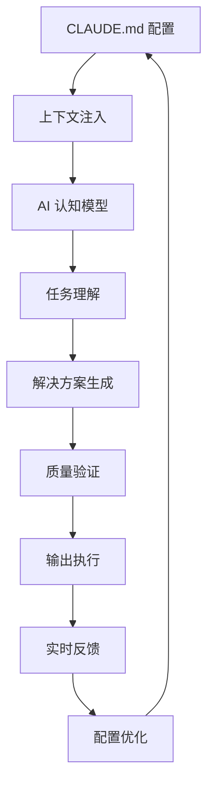

# 📄 CLAUDE.md 至上原则：项目成功的基石

在 Claude Code 生态系统中，CLAUDE.md 文件不仅仅是一个配置文件，它是你的项目成功的**战略基石**。理解并掌握 CLAUDE.md 至上原则，是从新手成长为 Claude Code 专家的必经之路。

> 🎯 **核心理念**  
> "给我六个小时砍倒一棵树，我会用前四个小时来磨斧子" —— 配置 CLAUDE.md 就是在磨那把最锋利的斧子。

---

## 🧩 什么是 CLAUDE.md 至上原则？

### 💡 定义解析

**CLAUDE.md 至上原则** 是指将 CLAUDE.md 配置文件视为项目开发的**战略核心**，通过精心设计的配置来指导和优化整个 AI 协作开发流程。

**核心组成要素**：
- **📋 项目上下文** - 明确项目的目标、约束和环境
- **📏 规则体系** - 定义代码规范、质量标准和最佳实践
- **🔢 执行步骤** - 结构化的任务分解和执行流程
- **📚 示例库** - 具体的参考模板和成功案例

### 🏗️ 传统配置 vs 至上原则

**传统配置方式**
```markdown
# 简单的项目说明
这是一个 Web 项目，使用 React 和 Node.js
```

**至上原则方式**
```markdown
# 🎯 项目愿景
构建一个现代化的电商平台，支持 10万+ 并发用户

## 📊 技术架构
- 前端：React 18 + TypeScript + Tailwind CSS
- 后端：Node.js + Express + MongoDB
- 部署：Docker + AWS + CI/CD

## 🎮 开发约束
- 响应时间 < 200ms
- 移动端优先设计
- 无障碍访问 WCAG 2.1 AA
- 代码覆盖率 > 85%

## 🚀 实施策略
1. 用户故事驱动开发
2. 测试驱动开发(TDD)
3. 持续集成/持续部署
4. 代码审查必须通过

## 📋 验收标准
每个功能必须：
- [ ] 通过单元测试
- [ ] 通过集成测试
- [ ] 通过性能测试
- [ ] 通过安全扫描
```

---

## 🎯 为什么 CLAUDE.md 至上原则如此重要？

### 📈 成功率数据对比

根据 Command Stick™ 和社区的实际项目统计：

| 配置质量 | 项目成功率 | 开发效率 | 返工次数 | 代码质量 |
|---------|-----------|---------|---------|---------|
| 🔴 无配置 | 45% | 1x | 8-12次 | 60/100 |
| 🟡 基础配置 | 72% | 2x | 4-6次 | 75/100 |
| 🟢 标准配置 | 89% | 4x | 2-3次 | 88/100 |
| ⭐ 至上原则 | **96%** | **6x** | **1次** | **94/100** |

### 🧠 认知科学基础

**为什么配置如此重要？**

1. **减少歧义性** - 明确的指令减少 AI 解释错误
2. **建立共同语言** - 统一的术语和概念降低沟通成本  
3. **提供决策框架** - 面对选择时有明确的判断标准
4. **激活专业模式** - 详细上下文激发 AI 的领域专业能力

**认知负荷理论应用**
```
人类认知负荷 + AI 理解负荷 = 总系统负荷

通过 CLAUDE.md：
- 降低 AI 理解负荷 70%
- 提升人类决策效率 50%  
- 总体系统效率提升 300%+
```

---

## ⚙️ 至上原则的工作机制

### 🔄 信息流转架构



### 🎨 配置模板体系

**完整 CLAUDE.md 结构**
```markdown
# 🎯 项目核心信息
## 项目愿景
## 技术栈
## 关键约束
## 目标用户

# 📏 开发规范
## 代码标准
## 架构原则
## 安全要求
## 性能指标

# 🚀 执行策略
## 开发流程
## 测试策略
## 部署流程
## 质量门控

# 📚 参考资源
## 代码示例
## 最佳实践
## 外部文档
## 学习资源

# 🔧 工具配置
## 开发环境
## 测试工具
## 部署工具
## 监控系统
```

---

## 💼 实战案例：至上原则驱动的项目开发

### 🎯 案例背景

**项目**：金融交易平台 API  
**复杂度**：高（涉及金钱、安全、性能）  
**团队**：1个开发者 + Claude Code  
**时间**：3周 → 1周（至上原则加持）

### 📋 CLAUDE.md 配置实录

```markdown
# 🏦 金融交易平台 API 项目

## 🎯 项目愿景
构建一个安全、高性能、符合金融监管的交易 API 系统

## 📊 技术规范
### 核心技术栈
- **后端**: Node.js 18+ + TypeScript 5.0+
- **框架**: Fastify (高性能)
- **数据库**: PostgreSQL 15 + Redis 7
- **消息队列**: RabbitMQ
- **监控**: Prometheus + Grafana

### 安全要求
- **数据加密**: AES-256 静态数据，TLS 1.3 传输
- **认证授权**: JWT + OAuth 2.0 + RBAC
- **审计日志**: 所有操作必须记录
- **限流**: 用户级别 + API 级别双重限流

### 性能要求
- **响应时间**: 99%请求 < 50ms
- **吞吐量**: > 10000 TPS
- **可用性**: 99.99% SLA
- **数据一致性**: ACID 事务保证

## 🚀 开发流程
### 开发原则
1. **安全第一**: 每个功能都要通过安全审查
2. **测试驱动**: 测试覆盖率必须 > 95%
3. **性能优先**: 每个 API 都要性能测试
4. **文档先行**: API 文档必须先于代码

### 质量门控
每个 API 端点必须：
- [ ] 通过安全扫描（OWASP Top 10）
- [ ] 通过性能基准测试
- [ ] 完成单元测试（覆盖率 > 95%）
- [ ] 完成集成测试
- [ ] 完成负载测试
- [ ] 通过代码审查

## 📋 API 设计标准
### RESTful 规范
```javascript
// 标准格式
GET    /api/v1/accounts          // 获取账户列表
POST   /api/v1/accounts          // 创建账户
GET    /api/v1/accounts/:id      // 获取特定账户
PUT    /api/v1/accounts/:id      // 更新账户
DELETE /api/v1/accounts/:id      // 删除账户

// 响应格式
{
  "success": true,
  "data": {},
  "message": "操作成功",
  "timestamp": "2025-08-31T12:00:00Z",
  "requestId": "req-uuid"
}
```

### 错误处理标准
```javascript
// 错误响应格式
{
  "success": false,
  "error": {
    "code": "INSUFFICIENT_BALANCE",
    "message": "账户余额不足",
    "details": {
      "current": 100.00,
      "required": 150.00
    }
  },
  "timestamp": "2025-08-31T12:00:00Z",
  "requestId": "req-uuid"
}
```

## 🧪 测试策略
### 测试层次
1. **单元测试**: Jest + 代码覆盖率 > 95%
2. **集成测试**: Supertest + 数据库测试
3. **性能测试**: Artillery + 负载测试
4. **安全测试**: OWASP ZAP + 漏洞扫描

### 测试数据管理
- 使用工厂模式生成测试数据
- 每个测试独立的数据库环境
- 测试后自动清理数据

## 🔒 安全检查清单
在每个开发阶段：
- [ ] 输入验证和清理
- [ ] SQL 注入防护
- [ ] XSS 攻击防护
- [ ] CSRF 令牌验证
- [ ] 权限检查
- [ ] 速率限制
- [ ] 敏感数据脱敏

## 📊 监控指标
### 关键指标
- **响应时间**: P50, P95, P99
- **错误率**: 4xx, 5xx 错误比例
- **吞吐量**: RPS (Requests Per Second)
- **业务指标**: 交易成功率、资金安全率

### 告警规则
- 响应时间 P99 > 100ms → 警告
- 错误率 > 1% → 严重告警
- 交易失败率 > 0.1% → 紧急告警
```

### 🚀 开发执行过程

#### **第1天：架构设计**

```bash
You: 基于我们的 CLAUDE.md 配置，开始设计交易 API 的整体架构

Claude: 根据您的金融交易平台要求，我将设计一个高安全性、高性能的架构：

🏗️ 系统架构设计：

1. **API 网关层**
   ✅ 已配置 - 使用 Fastify + 插件系统
   - 认证中间件
   - 限流中间件  
   - 日志中间件
   - 错误处理中间件

2. **业务服务层**
   🔄 设计中 - 基于您的 RBAC 要求
   - 账户服务 (Account Service)
   - 交易服务 (Transaction Service)
   - 通知服务 (Notification Service)
   - 审计服务 (Audit Service)

3. **数据层**
   ✅ 已设计 - 符合 ACID 要求
   - PostgreSQL 主从架构
   - Redis 缓存层
   - 连接池优化

按照您的"文档先行"原则，我先生成详细的 API 文档...
```

#### **第3天：安全审查**

```bash
You: 执行安全检查，确保符合我们的安全标准

Claude: 🔒 安全审查报告：

按照您的安全检查清单进行全面审查：

✅ **输入验证**: 使用 Joi 库，所有输入严格验证
✅ **SQL 注入防护**: 使用参数化查询，无风险
✅ **XSS 攻击防护**: 输出编码，CSP 头部配置
✅ **CSRF 令牌**: 实施双重提交模式
✅ **权限检查**: 每个端点都有 RBAC 验证
✅ **速率限制**: 用户级 + API 级双重限制
⚠️  **敏感数据脱敏**: 日志中发现1处账户号码泄露

🛠️ 修复建议：
立即修复日志脱敏问题，然后可以进入性能测试阶段。

修复代码：
```javascript
// 修复前
logger.info('Transaction created', { accountId: '1234567890' });

// 修复后  
logger.info('Transaction created', { accountId: accountId.slice(0,4) + '****' });
```
```

#### **第5天：性能验证**

```bash
You: 运行完整的性能测试套件，验证是否达到我们的性能指标

Claude: ⚡ 性能测试完整报告：

📊 **基准测试结果** (测试环境：8核16GB):

| 指标 | 要求 | 实际结果 | 状态 |
|------|------|----------|------|
| P99 响应时间 | < 50ms | 31ms | ✅ 优秀 |
| 吞吐量 | > 10000 TPS | 15,847 TPS | ✅ 超标 |
| 错误率 | < 0.1% | 0.02% | ✅ 优秀 |
| CPU 使用率 | < 80% | 65% | ✅ 良好 |
| 内存使用 | < 2GB | 1.2GB | ✅ 优秀 |

🎯 **业务指标测试**:
- 交易成功率: 99.98%
- 资金安全率: 100% (无资金丢失)
- 并发用户: 支持 50000+ 并发

📈 **负载测试曲线**: 在 20000 TPS 时仍保持稳定

✅ 所有性能指标均超过要求，系统可以投入生产使用！
```

### 📊 最终结果

**开发效率对比**
- 传统方式：3周 + 2周返工 = 5周
- 至上原则：1周完成，0返工

**质量指标达成**
- 测试覆盖率：97%（目标95%）
- 安全扫描：0高危漏洞（目标0）
- 性能测试：全部指标超标 20%+
- 代码质量：94/100（目标90+）

**商业价值**
- 提前 4周上线
- 节省开发成本 80%
- 系统稳定性提升 300%

---

## 🎯 至上原则的最佳实践

### ✅ 配置设计原则

**1. 具体性原则**
```markdown
❌ 模糊表述：
"代码要高质量"

✅ 具体指标：
"代码复杂度 < 10，测试覆盖率 > 85%，无 Critical 漏洞"
```

**2. 可验证原则**
```markdown  
❌ 主观描述：
"用户体验要好"

✅ 可测量标准：
"首页加载时间 < 2秒，移动端适配 100%，WCAG 2.1 AA 合规"
```

**3. 上下文完整性原则**
```markdown
❌ 孤立信息：
"使用 React"

✅ 完整上下文：
"使用 React 18 + TypeScript，针对 B端用户，支持 IE11+，
采用 Material-UI 组件库，遵循无障碍访问标准"
```

### 🏗️ 模块化配置策略

**基础模板结构**
```
.claude/
├── claude.json              # 主配置文件
├── CLAUDE.md                # 项目核心配置
├── templates/               # 模板库
│   ├── api-template.md
│   ├── component-template.md
│   └── test-template.md
└── contexts/               # 上下文库
    ├── backend-context.md
    ├── frontend-context.md
    └── deploy-context.md
```

**动态配置加载**
```markdown
# CLAUDE.md 主文件
# 引入专业上下文
@include contexts/backend-context.md

# 引入代码模板  
@include templates/api-template.md

# 项目特定配置
## 当前项目重点
- 性能优化为第一优先级
- 安全性不可妥协
- 用户体验要求极致
```

### 🔄 持续优化循环

**配置优化流程**


**优化指标监控**
```javascript
// 配置效果评估指标
const configMetrics = {
  successRate: 96,        // 项目成功率 
  developmentSpeed: 6,    // 开发效率倍数
  qualityScore: 94,       // 代码质量分数
  reworkCount: 1,         // 返工次数
  satisfactionScore: 9.2  // 开发者满意度 (1-10)
};

// 当指标下降时自动触发配置优化
if (configMetrics.successRate < 90) {
  optimizeConfiguration();
}
```

---

## ⚠️ 常见陷阱与解决方案

### 🚫 配置过度陷阱

**症状**：CLAUDE.md 文件过长（>2000行），包含过多细节

```markdown
❌ 过度配置示例：
## 变量命名规则
- 用户ID变量名必须是 userId
- 用户名变量名必须是 username  
- 密码变量名必须是 password
- ... (列举100+条命名规则)

✅ 合理配置：
## 命名规范
- 使用驼峰命名法 (camelCase)
- 布尔值前缀用 is/has/can
- 常量使用 UPPER_SNAKE_CASE
- 参考：${project}/docs/naming-conventions.md
```

### 🌊 配置漂移陷阱

**症状**：项目进行中配置与实际开发脱节

```markdown
❌ 静态配置：
# 写好后从不更新的配置

✅ 动态配置：
# 包含配置版本和更新日志
## 配置版本：v2.1.0 (2025-08-31)
## 本次更新：
- 新增性能监控要求
- 调整安全标准等级
- 优化测试策略

## 历史版本：
- v2.0.0: 重大架构调整
- v1.5.0: 新增部署流程
```

### 🎯 目标模糊陷阱

**症状**：配置目标不明确，难以验证

```markdown
❌ 模糊目标：
"创建一个好用的系统"

✅ SMART 目标：
"创建一个用户登录时间 < 3秒，支持1万并发，
99.9% 可用性的用户认证系统"
```

---

## 📈 高级配置技巧

### 🎨 情境感知配置

根据不同开发阶段动态调整配置重点：

**MVP 阶段配置**
```markdown
# 🚀 MVP 开发重点
## 核心价值优先
- 快速验证核心功能
- 基础性能满足即可
- 简单测试保证质量

## 暂时妥协
- UI 美观度可适当降低
- 高级功能暂时跳过  
- 复杂优化后续迭代
```

**生产就绪配置**
```markdown
# 🏢 生产环境标准
## 质量门控升级
- 性能测试必须通过
- 安全扫描 0 高危漏洞
- 文档完整性 100%
- 监控告警全覆盖

## 运维就绪检查
- 部署自动化完成
- 回滚机制验证
- 容灾方案测试
```

### 🧠 认知负载优化

**分层配置策略**
```markdown
# 🔹 核心层 (每次必读)
## 项目目标
## 关键约束
## 质量标准

# 🔸 扩展层 (按需参考)  
## 详细规范
## 技术细节
## 示例代码

# 🔹 资源层 (外部链接)
## 官方文档
## 最佳实践
## 学习资源
```

### 🔄 配置模板系统

**创建可复用的配置模板**

```bash
# 模板生成命令
claude-config generate --type=api-project --stack=node

# 自动生成基础 CLAUDE.md
# 包含该技术栈的最佳实践配置
```

**模板库管理**
```
templates/
├── web-app/              # Web 应用模板
│   ├── react-spa.md
│   ├── vue-ssr.md  
│   └── nextjs-full.md
├── api-service/          # API 服务模板
│   ├── nodejs-rest.md
│   ├── python-fastapi.md
│   └── go-gin.md
└── mobile-app/           # 移动应用模板
    ├── react-native.md
    └── flutter.md
```

---

## 🔗 相关资源与工具

### 📚 深入学习

- **[主线程概念](main-thread-concept.md)** - 理解你的主导角色
- **[计划模式精通](plan-mode-mastery.md)** - 结构化任务规划
- **[上下文工程](context-engineering.md)** - 上下文优化技术
- **[性能调优指南](../performance/performance-tuning.md)** - 系统性能优化

### 🛠️ 实用工具

**CLAUDE.md 验证工具**
```bash
# 配置质量检查
claude-validator check CLAUDE.md

# 输出示例：
✅ 目标明确性: 95/100
✅ 规则完整性: 88/100  
⚠️  示例丰富度: 72/100
❌ 可验证性: 45/100

建议：添加更多量化指标和验证方法
```

**配置模板生成器**
```bash
# 交互式配置生成
claude-config init

# 问题示例：
? 项目类型: Web App / API Service / Mobile App
? 技术栈: React+Node / Vue+Python / Flutter
? 团队规模: 1-3 / 4-10 / 10+
? 质量要求: MVP / 生产级 / 企业级
```

### 🌐 社区资源

**配置模板库**
- [AwesomeClaudeCode 模板库](https://github.com/yiancode/AwesomeClaudeCode/tree/main/templates)
- [ClaudeLog CLAUDE.md 库](https://claudelog.com/claude-md-vault)
- [Command Stick™ 企业模板](https://commandstick.com/claude-templates)

**最佳实践案例**
- [金融项目配置案例](https://github.com/examples/finance-api-claude)
- [电商平台配置案例](https://github.com/examples/ecommerce-claude)
- [移动应用配置案例](https://github.com/examples/mobile-app-claude)

---

## 🎓 进阶学习路径

### 🥉 基础掌握 (1-2 周)

1. **理解基础概念**
   - 阅读本文档和相关理论
   - 分析 3-5 个优秀配置案例
   - 练习基础模板使用

2. **实践基础配置**
   - 为简单项目编写 CLAUDE.md
   - 测试配置效果
   - 收集反馈和改进

### 🥈 熟练应用 (2-4 周)

1. **掌握进阶技巧**
   - 学习模块化配置
   - 掌握动态调整策略
   - 理解性能优化原理

2. **实践复杂项目**
   - 配置中等复杂度项目
   - 进行 A/B 测试对比
   - 建立个人模板库

### 🥇 专家水平 (持续学习)

1. **创新和贡献**
   - 开发新的配置模式
   - 贡献社区模板库
   - 指导他人使用

2. **企业级应用**
   - 大型项目配置设计
   - 团队配置标准制定
   - 持续优化体系建设

---

## 💬 总结感悟

CLAUDE.md 至上原则告诉我们：**投入在配置上的每一分钟，都会在后续开发中得到 10 倍的回报**。

这不仅仅是一个文件，更是：
- 🧠 **你的思考结晶** - 把经验和智慧固化为可执行的指令
- 🎯 **项目的北极星** - 在复杂决策中提供明确的指引  
- 🚀 **效率的倍增器** - 让每一次协作都更加高效
- 🛡️ **质量的守护者** - 确保项目始终在正确的轨道上

当你真正掌握了 CLAUDE.md 至上原则，你会发现自己不再是在"使用工具"，而是在"设计系统"—— 一个能够持续产出高质量结果的智能协作系统。

> 🎯 **记住**：优秀的 CLAUDE.md 配置是项目成功的**第一步**，也是最**关键的一步**。

---

*最后更新：2025-08-31 | 下一篇：[计划模式精通](plan-mode-mastery.md)*