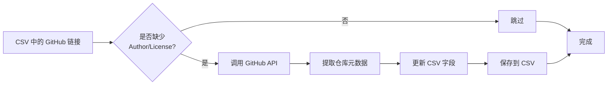
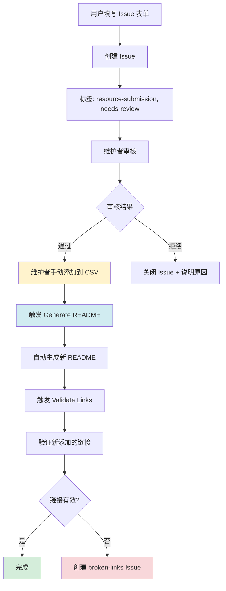
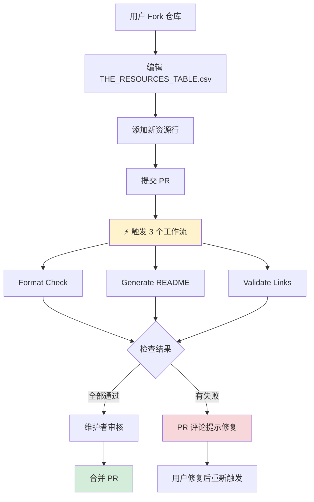
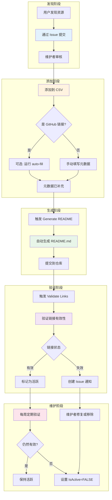

# 资源来源和管理流程

## 📋 资源来源总览

当前项目的资源**主要来自用户手动提交**，同时配备了**半自动化的元数据增强**工具。

### 资源获取方式对比

| 方式 | 实现状态 | 说明 |
|------|---------|------|
| 👥 **用户手动提交** | ✅ 已实现 | 主要来源，通过 GitHub Issue 或 PR |
| 🤖 **自动爬取/监控** | ❌ 未实现 | 暂无自动发现新资源的机制 |
| 🔄 **API 定期同步** | ❌ 未实现 | 暂无定期同步外部数据源 |
| 🧩 **元数据自动填充** | ✅ 已实现 | GitHub 仓库元数据自动提取 |
| 🔗 **链接自动验证** | ✅ 已实现 | 每周定期验证链接有效性 |

---

## 🎯 当前实现的自动化流程

### 1. 元数据自动填充 (`auto_fill_github_metadata.py`)

这是**唯一的半自动化获取**功能，用于从 GitHub API 自动提取元数据。

#### 功能说明

```python
# 自动提取的信息
metadata = {
    'author': owner,                    # 仓库所有者
    'author_profile': github_url,       # GitHub 主页
    'license': repository.license,      # 开源许可证
    'description': repository.description, # 仓库描述
    'stars': repository.stargazers_count,  # Star 数量
    'language': repository.language,    # 主要语言
    'updated_at': repository.updated_at # 最后更新时间
}
```

#### 工作流程



#### 使用方式

```bash
# 手动运行（本地）
make auto-fill

# 或直接运行脚本
python3 scripts/auto_fill_github_metadata.py
```

#### 限制条件

- ⚠️ **仅支持 GitHub 资源**：非 GitHub 链接会被跳过
- ⚠️ **API 速率限制**：
  - 无 Token: 60 请求/小时
  - 有 Token: 5000 请求/小时
- ⚠️ **不会覆盖现有数据**：已有 Author 和 License 的资源会被跳过
- ⚠️ **需要手动触发**：不在 GitHub Actions 中自动运行

---

## 👥 用户提交流程

### 方式 1: 通过 GitHub Issue 提交（推荐）

用户可以通过标准化的 Issue 表单提交新资源。

#### Issue 模板: `submit_resource.yml`

```yaml
表单字段：
✅ 资源名称 (必填)
✅ 资源链接 (必填)
✅ 主分类 (必填，13 个选项)
❓ 子分类 (可选)
✅ 资源描述 (必填，中英文)
❓ 作者 (可选，可自动提取)
❓ 作者主页 (可选，可自动提取)
❓ 许可证 (可选，可自动提取)
❓ 备用链接 (可选)
❓ 额外信息 (可选)
✅ 提交检查清单 (必填)
```

#### 提交后的处理流程



**关键步骤**：
1. 用户通过 Issue 表单提交
2. Issue 自动添加 `resource-submission` 和 `needs-review` 标签
3. 维护者审核内容
4. **手动**将资源添加到 CSV（使用 Issue 信息）
5. 自动化流程接管（生成 README、验证链接）

### 方式 2: 通过 Pull Request 提交

高级用户可以直接修改 CSV 文件并提交 PR。



---

## 🔄 完整的资源生命周期



---

## ❌ 未实现的自动化功能

以下功能当前**不存在**，资源完全依赖用户发现和提交：

### 1. 自动爬取/监控

```
❌ 监控 GitHub Topics (如 #claude-code)
❌ 爬取 Reddit/Discord 社区资源
❌ 监控 Twitter/X 上的分享
❌ 定期检查 awesome-lists
❌ RSS 订阅技术博客
```

### 2. 智能推荐系统

```
❌ 基于 GitHub API 发现相似项目
❌ 分析 Star/Fork 趋势推荐热门项目
❌ 从现有资源的依赖中发现新资源
❌ 用户行为分析推荐
```

### 3. 自动分类和质量评估

```
❌ AI 自动分类资源
❌ 自动评估资源质量得分
❌ 自动检测资源活跃度
❌ 社区投票系统
```

---

## 🚀 如何改进：建议的自动化方向

### 优先级 1: 半自动化资源发现

```python
# 示例：监控 GitHub Topics
def discover_claude_code_repos():
    """
    定期搜索 GitHub 上与 Claude Code 相关的新仓库
    """
    topics = ['claude-code', 'anthropic-claude', 'mcp-server']
    for topic in topics:
        repos = github.search_repositories(
            query=f'topic:{topic}',
            sort='updated',
            order='desc'
        )
        # 筛选最近更新的仓库
        # 创建 Issue 供维护者审核
```

**实现建议**：
- 添加 `scripts/discover_resources.py`
- 每周运行，自动创建 Issue
- 维护者审核后添加到 CSV

### 优先级 2: Issue 到 CSV 的自动化

```python
# 示例：从 Issue 自动生成 CSV 行
def process_resource_submission_issue(issue):
    """
    解析 resource-submission Issue，生成 CSV 行
    """
    # 从 Issue body 提取表单数据
    # 生成唯一 ID
    # 创建 PR 添加到 CSV
    # 请求维护者审核 PR
```

**实现建议**：
- 添加 GitHub Action 处理 `resource-submission` Issues
- 自动解析 Issue 表单数据
- 生成 PR 供维护者快速审核
- 减少手动复制粘贴工作

### 优先级 3: 智能元数据增强

```python
# 示例：使用 AI 生成描述
def enhance_resource_metadata(resource):
    """
    使用 Claude API 分析资源，生成高质量描述
    """
    # 爬取资源页面内容
    # 使用 Claude 分析并生成摘要
    # 自动翻译中英文描述
    # 建议适当的分类和标签
```

---

## 📊 当前资源统计

```bash
# 查看资源来源统计
python3 -c "
import csv
with open('THE_RESOURCES_TABLE.csv', 'r') as f:
    resources = list(csv.DictReader(f))
    print(f'总资源数: {len(resources)}')
    github_count = sum(1 for r in resources if 'github.com' in r.get('PrimaryLink', ''))
    print(f'GitHub 资源: {github_count} ({github_count/len(resources)*100:.1f}%)')
    non_github = len(resources) - github_count
    print(f'非 GitHub 资源: {non_github} ({non_github/len(resources)*100:.1f}%)')
"
```

**当前数据** (2025-12-17):
- 总资源数: 124
- GitHub 资源: ~85% (可自动提取元数据)
- 非 GitHub 资源: ~15% (需要手动维护)

---

## 🎯 总结

### ✅ 现有能力

1. **用户提交渠道完善**
   - 标准化的 Issue 表单
   - PR 直接修改 CSV
   - 详细的贡献指南

2. **元数据半自动化**
   - GitHub 仓库信息自动提取
   - 减少手动填写工作量

3. **质量保证**
   - 每周自动验证链接
   - PR 时自动检查格式
   - 自动生成文档

### ❌ 缺失能力

1. **资源发现完全依赖人工**
   - 无主动监控机制
   - 无推荐系统
   - 无社区反馈渠道

2. **手动工作量大**
   - Issue 到 CSV 需手动转换
   - 非 GitHub 资源全手动
   - 分类需人工判断

### 💡 改进建议

**短期**（1-2 周）：
- [ ] 实现 Issue 到 CSV 的半自动化
- [ ] 添加 auto-fill 到 GitHub Actions 定期执行
- [ ] 改进 Issue 模板，添加更多验证

**中期**（1-2 月）：
- [ ] 实现 GitHub Topics 监控脚本
- [ ] 添加社区推荐渠道（GitHub Discussions）
- [ ] 使用 AI 辅助生成描述和分类

**长期**（3-6 月）：
- [ ] 构建完整的资源发现系统
- [ ] 实现质量评分和排序
- [ ] 添加用户反馈和投票功能

---

## 📖 相关文档

- 贡献指南: [CONTRIBUTING.md](../CONTRIBUTING.md)
- Issue 模板: [.github/ISSUE_TEMPLATE/submit_resource.yml](../.github/ISSUE_TEMPLATE/submit_resource.yml)
- 元数据脚本: [scripts/auto_fill_github_metadata.py](../scripts/auto_fill_github_metadata.py)
- 工作流文档: [workflows-diagram.md](./workflows-diagram.md)
