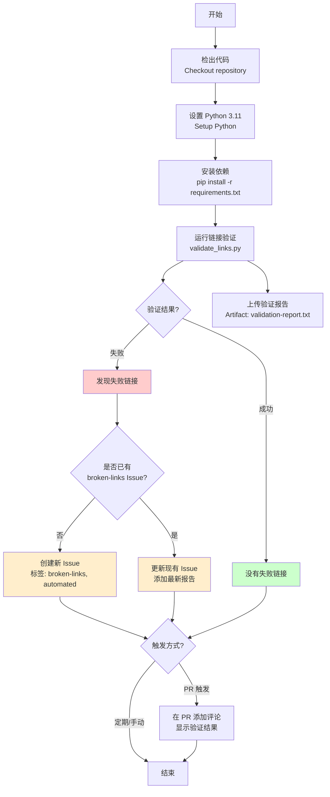
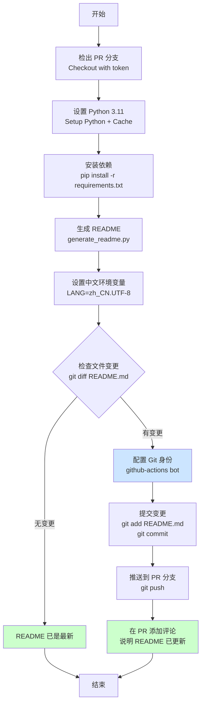
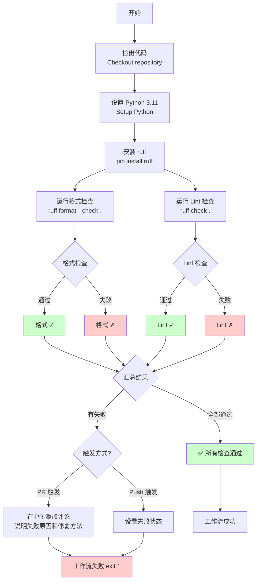
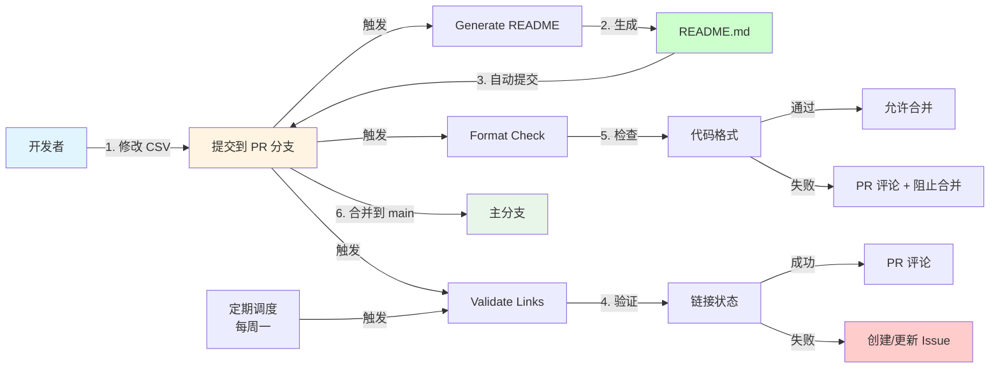
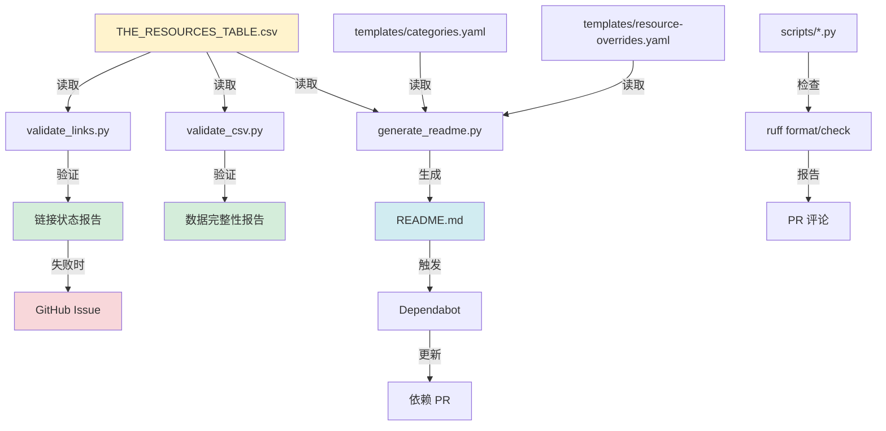

# GitHub Actions 工作流详解

## 工作流概览

项目包含 3 个主要工作流 + 1 个依赖更新工作流：

1. **Validate Links** - 定期链接验证（每周一次）
2. **Generate README** - 自动生成 README（PR 触发）
3. **Format Check** - 代码格式检查（PR/Push 触发）
4. **Dependabot Updates** - 依赖自动更新（GitHub 自动配置）

---

## 1️⃣ Validate Links 工作流

### 触发条件
```yaml
触发器：
├─ 定期触发：每周一 UTC 0:00 (北京时间周一 8:00)
├─ 手动触发：workflow_dispatch
└─ PR 触发：修改 THE_RESOURCES_TABLE.csv
```

### 流程图



### 关键步骤说明

**步骤 1-4：环境准备**
- 检出代码到 GitHub Actions runner
- 配置 Python 3.11 环境
- 安装项目依赖（PyYAML, requests 等）

**步骤 5：链接验证**
```bash
python3 scripts/validate_links.py > validation_report.txt 2>&1
```
- 读取 THE_RESOURCES_TABLE.csv
- 逐个验证所有资源的 PrimaryLink 和 SecondaryLink
- 检测 HTTP 状态码（200-399 为成功）
- 生成验证报告

**步骤 6：结果处理**
- 检查报告中是否包含 "❌" 或 "broken" 关键词
- 设置 `has_failures` 输出变量

**步骤 7-9：Issue 管理**（仅在有失败链接时）
- 查询是否已存在 `broken-links` 标签的 Issue
- 如果不存在，创建新 Issue
- 如果存在，在现有 Issue 添加评论

**步骤 10：Artifacts**
- 无论成功或失败，都上传验证报告
- 保留期：30 天
- 可在 Actions 页面下载查看

---

## 2️⃣ Generate README 工作流

### 触发条件
```yaml
触发器：
├─ PR 触发：修改以下文件时
│   ├─ THE_RESOURCES_TABLE.csv
│   ├─ templates/**
│   └─ scripts/generate_readme.py
└─ 手动触发：workflow_dispatch
```

### 流程图



### 关键步骤说明

**步骤 1：特殊检出配置**
```yaml
ref: ${{ github.head_ref }}  # 检出 PR 分支
token: ${{ secrets.GITHUB_TOKEN }}  # 使用 Token 以便推送
```

**步骤 2-5：生成 README**
```bash
LANG=zh_CN.UTF-8 LC_ALL=zh_CN.UTF-8 python3 scripts/generate_readme.py
```
- 设置中文环境变量确保正确处理中文字符
- 从 CSV 和模板生成完整的 README.md
- 包含统计信息、目录、分类内容等

**步骤 6：变更检测**
```bash
git diff --quiet README.md || echo "changed=true"
```
- 使用 git diff 检测 README.md 是否有变化
- 只有在有变化时才提交

**步骤 7-9：自动提交**（仅在有变更时）
- 配置 Git 用户为 `github-actions[bot]`
- 提交信息：`docs: 自动生成 README [skip ci]`
- `[skip ci]` 避免触发新的 CI 循环

**步骤 10：PR 反馈**
- 在 PR 添加友好的评论
- 提示用户 README 已更新
- 包含 emoji 和统计信息

---

## 3️⃣ Format Check 工作流

### 触发条件
```yaml
触发器：
├─ PR 触发：修改 .py 或 pyproject.toml 文件
├─ Push 到 main：修改 .py 文件
└─ 手动触发：workflow_dispatch
```

### 流程图



### 关键步骤说明

**步骤 1-4：环境准备**
- 使用 ruff 进行 Python 代码格式化和 Lint 检查
- ruff 是新一代 Python linter，速度极快

**步骤 5：格式检查**
```bash
ruff format --check .
```
- 检查代码格式是否符合标准（PEP 8）
- 只检查，不修改文件
- `continue-on-error: true` 允许继续执行

**步骤 6：Lint 检查**
```bash
ruff check .
```
- 检查代码质量问题
- 未使用的导入、变量
- 潜在的 bug 和反模式

**步骤 7-8：结果汇总**
- 收集两个检查的结果
- 只要有一个失败，整体就失败

**步骤 9：PR 反馈**（仅 PR 触发且失败时）
- 添加详细的评论说明问题
- 提供修复命令：
  ```bash
  make format  # 自动修复格式问题
  ```
- 包含 pre-commit hook 配置建议

**步骤 10：失败处理**
- 如果检查失败，工作流返回失败状态
- 阻止 PR 合并（如果设置了分支保护规则）

---

## 工作流交互关系图



---

## 数据流向图



---

## 完整执行时间线示例

### 场景：开发者添加新资源

```
时间线：
┌─────────────────────────────────────────────────────────────────┐
│ T+0s    开发者修改 THE_RESOURCES_TABLE.csv，添加新资源          │
│ T+1s    git push 到 feature/add-new-resource 分支              │
│ T+2s    GitHub 接收到 push 事件                                │
└─────────────────────────────────────────────────────────────────┘
         ↓
┌─────────────────────────────────────────────────────────────────┐
│ T+3s    创建 Pull Request                                       │
└─────────────────────────────────────────────────────────────────┘
         ↓
┌─────────────────────────────────────────────────────────────────┐
│ T+4s    ⚡ 并行触发 3 个工作流：                                │
│         ├─ Generate README (工作流 1)                          │
│         ├─ Validate Links (工作流 2)                           │
│         └─ Format Check (工作流 3)                             │
└─────────────────────────────────────────────────────────────────┘
         ↓
┌─────────────────────────────────────────────────────────────────┐
│ T+10s   工作流 3 完成 (最快，仅检查 Python 文件)                │
│         └─ ✅ Format Check 通过                                │
└─────────────────────────────────────────────────────────────────┘
         ↓
┌─────────────────────────────────────────────────────────────────┐
│ T+15s   工作流 1 完成                                           │
│         ├─ 生成新的 README.md                                  │
│         ├─ 自动提交到 PR 分支                                   │
│         └─ 💬 在 PR 添加评论：README 已更新                     │
└─────────────────────────────────────────────────────────────────┘
         ↓
┌─────────────────────────────────────────────────────────────────┐
│ T+45s   工作流 2 完成 (最慢，需要验证所有链接)                   │
│         ├─ 验证 124 个资源的链接                                │
│         ├─ 发现 2 个失败链接                                    │
│         ├─ 上传验证报告到 Artifacts                             │
│         ├─ 🐛 创建 Issue: "链接验证失败"                        │
│         └─ 💬 在 PR 添加评论：发现失败链接                      │
└─────────────────────────────────────────────────────────────────┘
         ↓
┌─────────────────────────────────────────────────────────────────┐
│ T+60s   开发者查看 PR                                           │
│         ├─ ✅ 看到 README 已自动更新                            │
│         ├─ ⚠️  看到链接验证警告                                 │
│         └─ 点击查看详细报告                                     │
└─────────────────────────────────────────────────────────────────┘
         ↓
┌─────────────────────────────────────────────────────────────────┐
│ T+120s  开发者修复失败的链接                                     │
│         └─ git push 更新 (触发新一轮工作流)                     │
└─────────────────────────────────────────────────────────────────┘
         ↓
┌─────────────────────────────────────────────────────────────────┐
│ T+180s  所有检查通过                                            │
│         ├─ ✅ Format Check                                      │
│         ├─ ✅ Generate README                                   │
│         └─ ✅ Validate Links                                    │
└─────────────────────────────────────────────────────────────────┘
         ↓
┌─────────────────────────────────────────────────────────────────┐
│ T+200s  维护者审查并合并 PR                                      │
│         └─ 合并到 main 分支                                     │
└─────────────────────────────────────────────────────────────────┘
```

---

## 定期任务时间线

```
周一 (Monday)
00:00 UTC (08:00 CST)
    ↓
┌─────────────────────────────────────────────────────────────────┐
│ 🕐 Validate Links 定期触发                                      │
│    ├─ 验证所有 124 个资源                                       │
│    ├─ 检测死链、重定向、超时                                    │
│    └─ 生成周度报告                                             │
└─────────────────────────────────────────────────────────────────┘
    ↓
┌─────────────────────────────────────────────────────────────────┐
│ 如果发现问题：                                                   │
│ ├─ 创建/更新 Issue with broken-links 标签                      │
│ ├─ 上传详细报告到 Artifacts                                     │
│ └─ 等待维护者处理                                               │
└─────────────────────────────────────────────────────────────────┘

周二 - 周日
    ↓
┌─────────────────────────────────────────────────────────────────┐
│ Dependabot 每日检查依赖更新                                      │
│ ├─ 检测 requirements.txt 更新                                   │
│ ├─ 检测 GitHub Actions 版本更新                                │
│ └─ 自动创建 PR                                                  │
└─────────────────────────────────────────────────────────────────┘
```

---

## 工作流配置对比表

| 特性 | Validate Links | Generate README | Format Check |
|------|---------------|----------------|--------------|
| **触发频率** | 每周 + PR + 手动 | PR + 手动 | PR + Push + 手动 |
| **执行时间** | ~30-60秒 | ~10-20秒 | ~5-10秒 |
| **主要工具** | requests, urllib | PyYAML | ruff |
| **Python 版本** | 3.11 | 3.11 | 3.11 |
| **失败后果** | 创建 Issue | PR 评论 | 阻止合并 |
| **自动修复** | ❌ | ✅ (生成 README) | ❌ |
| **Artifacts** | ✅ (报告) | ❌ | ❌ |
| **成本影响** | 中 (HTTP 请求) | 低 | 低 |

---

## 总结

### 工作流设计原则

1. **自动化优先** - 减少人工干预，提高效率
2. **快速反馈** - PR 触发，立即得到结果
3. **友好提示** - 清晰的评论和 Issue 说明
4. **防御性设计** - continue-on-error 避免单点失败
5. **可追溯性** - Artifacts 保存详细报告

### 优势

- ✅ 自动生成 README，保持数据同步
- ✅ 定期检测死链，维护资源质量
- ✅ 代码格式检查，保持代码一致性
- ✅ 并行执行，节省时间
- ✅ 智能 Issue 管理，避免重复

### 可改进空间

- 🔧 添加测试覆盖率报告
- 🔧 集成代码质量分析工具
- 🔧 添加自动发布工作流
- 🔧 实现自动修复死链（查找替代资源）
